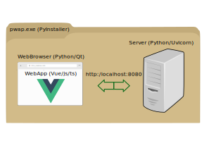

# pwap
## Progressive Web Application Playground / PWA as executable
This is a project to get in touch with progressiv web applications from a Python and VUE point of view.


## Setup Python venv
```
    py -3 -m pip poetry
    py -3 -m venv .venv
    py -3 -m pip poetry
    py -3 -m poetry update
```

## Cracked nuts
- Start server and web browser from the same process
    - [start async main loop](https://github.com/mmoosstt/pwap/blob/7a0684ff601d71fc3a39c19766307dda4c15ed6d/lib/main.py#L45)
    - [pyside startup loop for async](https://github.com/mmoosstt/pwap/blob/7a0684ff601d71fc3a39c19766307dda4c15ed6d/lib/spos/ui/app/client.py#L195)
- Display stdout for java errors in web browser
    - [java script callback](https://github.com/mmoosstt/pwap/blob/7a0684ff601d71fc3a39c19766307dda4c15ed6d/lib/spos/ui/app/client.py#L97)
    - [reroute stdin/out](https://github.com/mmoosstt/pwap/blob/7a0684ff601d71fc3a39c19766307dda4c15ed6d/lib/spos/ui/app/client.py#L30)

## Next nuts
- How to insert javascript code into vue app via qt-webbrowser? Any Idea?
- ...
